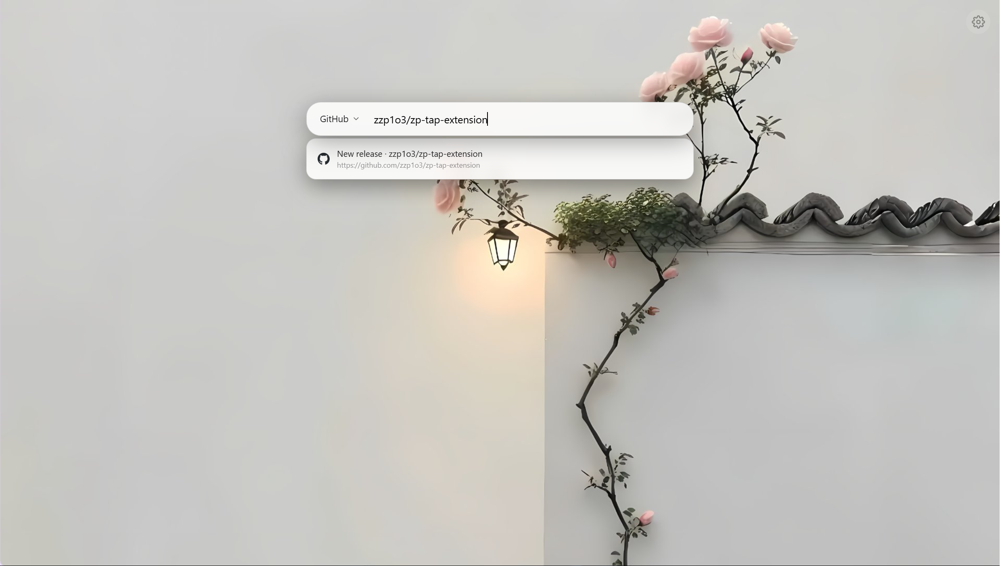

# Tap 新标签页

极简 Chrome / Edge 新标签页扩展，纯本地，零运行时构建。

| |   |   |
|---|---|---|

## 特性

- **打开即聚焦**：新标签页打开后焦点自动落在页面上，直接打字即可搜索——通过「启动页立即重定向」让地址栏显示完整 URL，规避 Chrome 对空地址栏的焦点抢占。
- **极简默认态**：打开新标签页只见背景，无可视控件。首次使用自动展示默认风景背景。
- **打字即唤出**：按下任意字符键即唤出顶部搜索框与建议面板，Esc 回纯背景。
- **搜索引擎切换**：
  - 预置：必应 / 哔哩哔哩 / GitHub / 百度 / 知乎 / Google / Yandex
  - 支持自定义任意引擎（名称 + `{q}` URL 模板）并拖拽排序
  - 下拉选择 + **Ctrl+↑/Ctrl+↓** 在快捷组内循环
- **智能直达**：输入建议混排书签与浏览历史，frecency 打分（频次 × 近期 × 命中位置 × 书签加权），同域名只取访问次数最高的一条。
- **回车语义**：选中建议 → 直达该 URL；输入像域名（含 TLD）→ 直达；否则用当前引擎搜索。
- **背景媒体**：
  - 支持图片/视频，本地上传或远程 URL
  - 客户端自动压缩图片；视频原样保存，上传时自动抓取首帧缩略图
  - 三种轮播模式：「每次打开换一张」「定时切换」「固定」
  - 每张卡片可勾选参与轮播 / 设为固定背景
- **主题系统**：深色（黑底白字）/ 浅色（白底黑字）/ 随系统，切主题有 0.5s 渐变过渡。
- **favicon 四源回退**：Chrome 本地缓存 → 国内 CDN → Google s2 → 首字母徽章。
- **约束保护**：至少保留一个轮播项、一个固定项、一个搜索引擎。删光媒体/引擎时自动回退默认值。
- 全部数据存于本机，无账号、不上传。

## 安装

```bash
git clone git@github.com:zzp1o3/zp-tap-extension.git
```
或者release中下载zip

### 设为启动页（获得「打开即聚焦输入框」的体验）

本扩展是**普通扩展页**（非新标签页覆盖），加载后：

1. 点击扩展图标打开 Tap 页面
2. Chrome 设置 → 「启动时」→ 「打开特定网页」→ 添加地址
   `chrome-extension://<扩展ID>/src/newtab/index.html`（扩展 ID 可在 `chrome://extensions` 看到）
3. 以后打开 Chrome 即进入 Tap 页面，且**焦点自动落在输入框**（普通页不抢焦点，可像 ChatGPT 一样秒聚焦）

Chrome / Edge → `chrome://extensions` → 开启开发者模式 → 加载已解压的扩展程序 → 选择仓库根目录。

打开新标签页即可使用。

## 权限

| 权限 | 用途 |
|------|------|
| `bookmarks` | 搜索书签生成建议 |
| `history` | 搜索浏览历史生成建议 |
| `storage` | 存储引擎列表、快捷组、主题、壁纸配置 |
| `unlimitedStorage` | IndexedDB 壁纸/视频配额冗余 |
| `favicon` | 启用 Chrome 内置 favicon API（四源回退第一级） |

## 目录结构

```
manifest.json
_locales/                         i18n（中/英）
icons/                            扩展图标（由 icons/zp-tap.png 派生）
scripts/gen_icons.py              图标生成脚本
src/background/sw.js              MV3 service worker（占位）
src/newtab/
  index.html main.js              新标签页主入口
  tailwind.css                    Tailwind 产物（已提交，直接可用）
  tailwind.input.css              Tailwind 源文件 + 主题变量
  engines.js                      搜索引擎配置
  storage.js                      IndexedDB + chrome.storage 封装
  suggestions.js                  搜索建议 + 打分 + 渲染
  url-detect.js                   URL 判定器
  favicon.js                      四源 favicon 回退
  settings/
    settings.html settings.js     右侧抽屉设置面板
```

## 开发

- 纯原生 HTML/JS，无运行时构建依赖，`npm install` 仅用于修改样式后重生成 Tailwind CSS。
- 修改 `tailwind.input.css` 后：`npm install && npm run build:css`
- 重派生图标：`uv run --with=pillow python scripts/gen_icons.py`

## License

MIT
